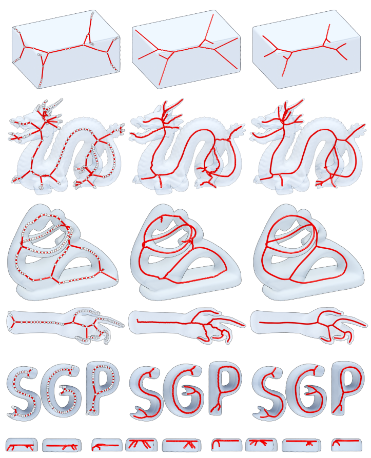

# [](https://romi-project.eu) / romicgal

[](https://www.gnu.org/licenses/lgpl-3.0.en.html)
[]()
[](https://pypi.org/project/romicgal/)
[](https://anaconda.org/romi-eu/romicgal)
[](https://github.com/romi/romicgal)

## Overview

This package contains Python bindings to use the following CGAL method: `CGAL/extract_mean_curvature_flow_skeleton`.

<figure>
  
  <figcaption>
    This algorithm extracts a curve skeleton for a triangulated polygonal mesh without borders, based on mean curvature flow.  
    <u>Source</u>: Tagliasacchi et al., _Mean Curvature Skeletons_. **Computer Graphics Forum** (2012).
  </figcaption>
</figure>

## Reference

Andrea Tagliasacchi, Ibraheem Alhashim, Matt Olson, and Hao Zhang. _Mean Curvature Skeletons_.  
**Computer Graphics Forum** (Proceedings of the Symposium on Geometry Processing), 31(5):1735–1744, 2012.  
[10.1111/j.1467-8659.2012.03178.x](https://doi.org/10.1111/j.1467-8659.2012.03178.x).  

Free [PDF](https://www.cs.sfu.ca/~haoz/pubs/tag_sgp12.pdf).

CGAL Reference manual for [Surface mesh skeletonization](https://doc.cgal.org/5.4.5/Surface_mesh_skeletonization/group__PkgSurfaceMeshSkeletonizationRef.html).

## Getting Started

The recommended way to install this library is by using the **conda package**.

### Conda Package

In your **activated** environment of choice, install the conda package by running:

```shell
conda install romicgal -c romi-eu
```

### Install from Source

#### Requirements

To build and install from source, the following dependencies are required:
- **C++ build tools** (_e.g._, `cmake` and `make`)
- A **C++ Compiler** compliant with C++ standard 11 or later (_e.g._, `gcc` or `clang`)
- The **CGAL library** (`CGAL`)
- The **Eigen library** (`Eigen3`)
- The **GMP library** (`GMP`)
- The **MPFR library** (`MPFR`)

**Example:** On Ubuntu 22.04, you can install these dependencies with:

```shell
sudo apt install \
    build-essential \
    gcc \
    libcgal-dev \
    libeigen3-dev \
    libgmp-dev \
    libmpfr-dev
```

#### Cloning the Repository  

First, clone the source code and navigate to the project directory:

```shell
git clone https://github.com/romi/romicgal.git
cd romicgal
```

#### Setting Up a Virtual Environment  

We recommend creating a dedicated conda environment to install the package and its dependencies. Use the provided YAML file to create an environment named `romicgal` as shown below:

```shell
conda env create --file conda/env/romicgal.yaml
```

#### Building and Installing  

Activate your newly created environment and install the sources using `pip`:

```shell
conda activate romicgal
python -m pip install .
```

## Usage

A quick usage example:

```python
import romicgal
from open3d import open3d

mesh = open3d.io.read_triangle_mesh('sample/TriangleMesh.ply')
points, lines, skelcorres = romicgal.skeletonize_mesh_with_corres(mesh.vertices, mesh.triangles)

l = open3d.geometry.LineSet()
l.points = open3d.utility.Vector3dVector(points)
l.lines = open3d.utility.Vector2iVector(lines)
open3d.visualization.draw_geometries([l])
```

## Conda Packaging

### Install Requirements for Packaging  

To package the library, follow the official Anaconda documentation on [Conda Packages](https://docs.anaconda.com/anacondaorg/user-guide/packages/conda-packages).

First, install `anaconda-client` and `conda-build` in the **base environment**:

```shell
conda install anaconda-client conda-build
```

:warning: **WARNING** :warning:  
> These steps must be performed in the **base** conda environment.

### Building Conda Packages  

From the root `romicgal/` directory and within the **base environment**, build the conda packages using the following command:

```shell
conda build conda/recipe/ -c conda-forge -c open3d-admin
```

The built packages will be stored in the folder `~/miniconda3/conda-bld/linux-64/`.

:warning: **WARNING** :warning:  
> This process must be completed in the **base** conda environment.

### Uploading Conda Packages  

After successfully building the package, you can upload it with the command:

```shell
anaconda upload --user romi-eu --label main ~/miniconda3/conda-bld/linux-64/romicgal*.tar.bz2
```

:warning: **WARNING** :warning:  
> This process must be completed in the **base** conda environment.
