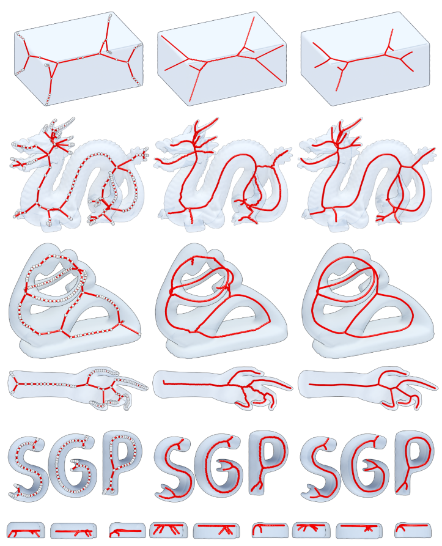

# CGAL Python Bindings for Skeletonization

Python bindings to use: `CGAL/extract_mean_curvature_flow_skeleton`.

<figure>
  
  <figcaption>
    This algorithm extracts a curve skeleton for a triangulated polygonal mesh without borders, based on mean curvature flow.  
    <u>Source</u>: Tagliasacchi et al., _Mean Curvature Skeletons_. **Computer Graphics Forum** (2012).
  </figcaption>
</figure>

## Reference

Andrea Tagliasacchi, Ibraheem Alhashim, Matt Olson, and Hao Zhang. _Mean Curvature Skeletons_.  
**Computer Graphics Forum** (Proceedings of the Symposium on Geometry Processing), 31(5):1735–1744, 2012.  
[10.1111/j.1467-8659.2012.03178.x](https://doi.org/10.1111/j.1467-8659.2012.03178.x).  

Free [PDF](https://www.cs.sfu.ca/~haoz/pubs/tag_sgp12.pdf).  

CGAL Reference manual for [Surface mesh skeletonization](
https://doc.cgal.org/5.4.5/Surface_mesh_skeletonization/group__PkgSurfaceMeshSkeletonizationRef.html).

## Getting Started

The recommended installation procedure is to **use the conda package**.

### Conda Package

In the **activated** environment of your choice, to install the conda package, simply run:

```shell
conda install romicgal -c romi-eu
```

### Install from Sources

#### Requirements

You need to install:  
- `gcc`  
- `build-essential`  
- `libeigen3-dev`  
- `libcgal-dev`

For example, on Ubuntu:
```shell
sudo apt install \
    build-essential \
    gcc \
    libcgal-dev \
    libeigen3-dev
```

#### Clone the Sources

```shell
git clone https://github.com/romi/romicgal.git
cd romicgal
```

#### Build & Install

You can install the package dependencies in an isolated conda environment with:

```shell
conda env create --file conda/env/romicgal.yaml
```

Now you should activate your environment (named `romicgal` here) and install the sources with `pip`:

```shell
conda activate romicgal
python -m pip install -e .
```

## Usage

A quick usage example:

```python
import romicgal
from open3d import open3d

mesh = open3d.io.read_triangle_mesh('sample/mesh.ply')
points, lines, skelcorres = romicgal.skeletonize_mesh_with_corres(mesh.vertices, mesh.triangles)

l = open3d.geometry.LineSet()
l.points = open3d.utility.Vector3dVector(points)
l.lines = open3d.utility.Vector2iVector(lines)
open3d.visualization.draw_geometries([l])
```

:warning: **WARNING** :warning:  
To use the newly installed package, do not forget to activate the conda environment:

```shell
conda activate romicgal
```

## Conda Packaging

### Build Packages

To build the `romicgal` conda packages, from the root folder in the `base` environment, run:

```shell
conda build conda/recipe/ -c conda-forge
```

:warning: **WARNING** :warning:  
> This must be done in the `base` environment!

Built packages are available under `~/miniconda3/conda-bld/linux-64/`.

### Upload Packages

After a successful build, to upload the packages, run:

```shell
anaconda upload --user romi-eu --label main ~/miniconda3/conda-bld/linux-64/romicgal*.tar.bz2
```